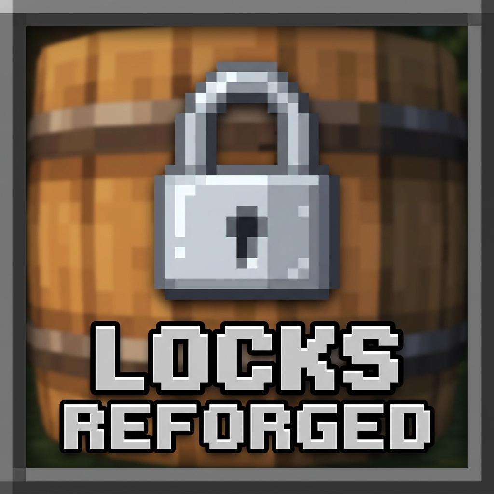

# Locks 1.20.1 (多平台锁模组 / Cross-platform Lock Mod)

基于 Architectury 框架开发的 Minecraft 1.20.1 多平台（Forge/Fabric）锁与安全机制模组。
A Minecraft 1.20.1 cross-platform (Forge/Fabric) lock and security mod built with the Architectury API.

---

## 📥 简介 / Introduction
**Locks** 是一个专注于在 Minecraft 中实现物理容器锁以及相关玩法的模组。它不仅能够保护你的私有财产，还能与世界生成的遗迹进行深度结合，为你探索地牢、村庄等结构时带来更具沉浸感的开锁与寻宝体验。

**Locks** is a mod focused on implementing physical container locks and related gameplay mechanics in Minecraft. Not only does it protect your private property, but it also deeply integrates with world-generated structures, bringing a more immersive lock-picking and treasure-hunting experience when you explore dungeons, villages, and other ruins.

## ⚙️ 核心机制详解 / Detailed Mechanics

### 1. 锁与保护机制 / Locking Mechanism
*   **多材质锁具 (Multi-tier Locks)**: 模组提供木、铁、钢、金、钻石、下界合金等多种材质的锁。玩家可以将锁手持并右键安装在箱子、特定容器或大门机构方块上。  
    The mod provides various locks made of Wood, Iron, Steel, Gold, Diamond, and Netherite. Players can right-click to attach a lock onto chests, specific containers, or door mechanism blocks.
*   **绝对防护 (Absolute Protection)**: 一旦方块被上锁，任何未持对应钥匙的交互（打开容器等）都会被拦截，直到锁被合法打开或强行破坏。  
    Once a block is locked, any unauthorized interaction (like opening containers) will be intercepted until the lock is legally opened or forcefully destroyed.

### 2. 钥匙与钥匙环 / Keys & Key Rings
*   **配对与复制 (Pairing & Copying)**: 空白钥匙在合成台上可以与已存在的钥匙或特定的锁具进行配对，生成专属钥匙。  
    Blank keys can be paired with existing keys or specific locks on a crafting table to generate a unique paired key.
*   **钥匙环 (Key Rings)**: 随着探索，你的钥匙会越来越多。钥匙环可以作为一个聚合容器，将几十把钥匙存入其中。手持钥匙环交互时程序会自动遍历并匹配目标锁具的钥匙，极大地节省背包空间。  
    As you explore, you will collect many keys. The Key Ring acts as an aggregate container that can store dozens of keys. Interacting with a locked block while holding a Key Ring will automatically search and match the correct key, greatly saving inventory space.
*   **万能钥匙 (Master Key)**: 通常用于创造模式或服主管理，它可以完全无视安全验证直接开启游戏内所有的锁。  
    Usually meant for Creative mode or Server Admins, it bypasses all pairing rules and opens any lock in the game instantly.

### 3. 撬锁小游戏系统 / Lock-picking Minigame
*   如果玩家恰好将对应的钥匙遗失，可以使用对应的 **开锁器 (Lock Pick)** 强制进行解锁。这将开启一个独立的沉浸式小游戏界面（并伴随真实的机械弹子声效）。  
    If the player happens to lose their key, they can use a **Lock Pick** to force it open. This triggers an independent immersive mini-game UI (accompanied by realistic mechanical tumbler sound effects).
*   **难度硬核缩放 (Difficulty Scaling)**: 不同材质的锁，其内部弹子的数量和挑战难度完全不同。木锁非常容易撬开，而钻石锁或下界合金锁不仅需要极高阶的精密开锁器，还需要巨大的耐心与技巧。  
    The number of tumbler pins and their challenge level vary greatly depending on the lock's material. Wooden locks are easy to pick, while Diamond or Netherite locks require not only high-tier lock picks but also immense patience and skill.

### 4. 暴力破锁机制 / Brute-force Lock Breaking
*   **强拆行为 (Forceful Breaking)**: 缺乏耐心的玩家可以选择拿起斧头等高伤害工具，直接对准锁具进行左键猛烈敲击以将物理锁具破坏。  
    Impatient players can grab high-damage tools like axes and directly left-click the lock fiercely to smash it into pieces.
*   **耐久度惩罚 (Durability Penalty)**: 破锁并非毫无代价。每次攻击锁具都会大量消耗并扣除工具的真实耐久度。低级工具面对高级锁时不但破防效率极低，还极容易让工具直接在你手中彻底碎裂。  
    Breaking locks comes with a massive cost. Each strike consumes a large amount of the tool's actual durability. A low-tier tool facing a high-tier lock will not only be extremely inefficient but also easily shatter completely in your hands.
*   **惩罚反伤系统 (Shock & Immunity Mechanics)**: 高级锁具受到暴力强拆时，可能会触发自身蕴含的特殊能量（如电击反伤惩罚），对玩家造成直接伤害。但玩家如果使用金或下界合金等具有极强魔力和绝缘属性的材质制造的工具来破拆它，系统会触发免疫豁免机制保护玩家。  
    When high-tier locks are forcefully broken, they may unleash special contained energy (like a shocking damage penalty), dealing direct damage to the player. However, if the player uses tools made of Gold or Netherite—materials with strong magical and insulating properties—the system will trigger an immunity mechanism to protect the player.

### 5. 世界生成与战利品池整合 / World Gen & Loot Module
*   **无缝战利品挂钩 (Seamless Loot Hook)**: 该模组彻底拦截并重构了原版《我的世界》的世界战利品表（Loot Tables）加载逻辑。在世界内自然生成的原版或模组提供的结构宝箱（如废弃矿井、要塞走廊、村庄铁匠铺等）上，Loot系统会依据群系和战利品价值，随机在宝箱上生成一把对应难度的实体锁。  
    The mod thoroughly intercepts and reconstructs the vanilla Minecraft World Loot Table loading logic. On naturally generated structure chests provided by vanilla or mods (e.g., abandoned mineshafts, stronghold corridors, village blacksmiths), the Loot system will randomly generate a physical lock of corresponding difficulty right on the chest based on the biome and loot value.
*   这正是你出门探险时总要在兜里揣上几个开锁器或一柄好战斧的终极原因 —— 因为你永远不知道在地下百米的洞穴末端，那个尘封着远古附魔书的宝箱到底挂着怎样一把坚不可摧的地牢钢锁！  
    This is the ultimate reason why you should always carry a few lock picks or a sturdy battle axe in your pocket when adventuring—because you never know what kind of indestructible dungeon steel lock is hanging on that chest sealing an ancient enchanted book at the end of a hundred-meter-deep cave!

## ⚙️ 配置系统 / Configuration

配置分为两部分 / Configuration is divided into two parts:
1. **配置文件 (Config)**：位于 `config/` 目录下。例如 `locks-server.toml` 可精细控制工具破锁的强制耗损、世界生成概率、特种附魔惩罚等极具深度的底层机制。(所有修改可同步自动应用)  
   Located in the `config/` directory. For example, `locks-server.toml` allows highly detailed control over deep core mechanics like compulsory tool durability loss during forceful breaks, world generation probabilities, special enchantment penalties, etc.
   
2. **数据包 (Data Pack)**：锁的生成规则、权重以及结构白名单等已100%数据化。修改或通过数据包覆盖 `data/locks/loot_tables/` 下的任何一个表单规则即可自由调整各类遗迹中的自然落锁情况。  
   The rules, weights, and structure whitelists for generating locks are 100% data-driven. Modifying or overriding any table rules under `data/locks/loot_tables/` via a datapack allows you to freely redesign natural locker situations in every ruin across the land.
